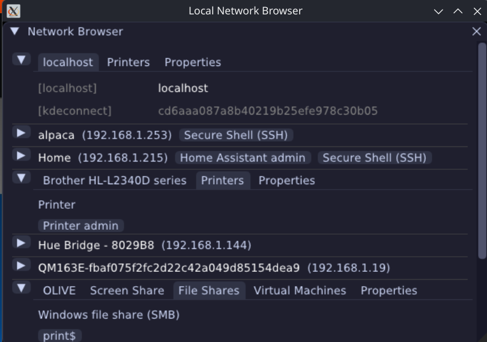

# Netlook, network browser



Proof of concept (ai-slop-coded).

Simple network browser via:

- mDNS
- `/etc/hosts`
- `~/.ssh/known_hosts`
- ARP Cache

This is built for my own use, I couldn't remember the IPs for everything on my network, this can
pull some basic information back on things like:

- **File shares:** SMB (via WSDD and MDNS), SFTP
- **Printers:** CUPS, IPP
- **Admin pages:** Discovered via MDNS

## Run

```sh
$ uv run netlook
```

## Test

```sh
$ uv run pytest
```
