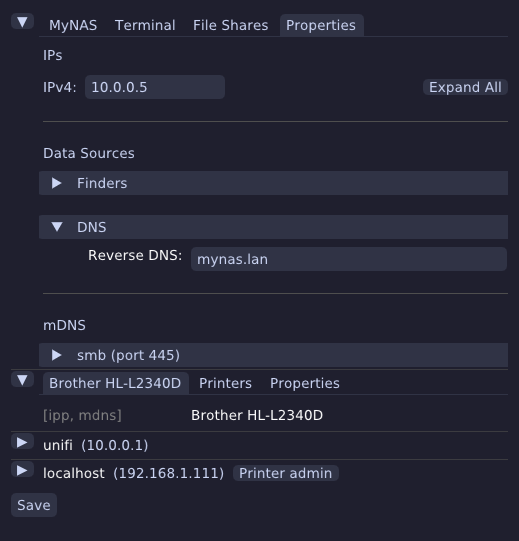
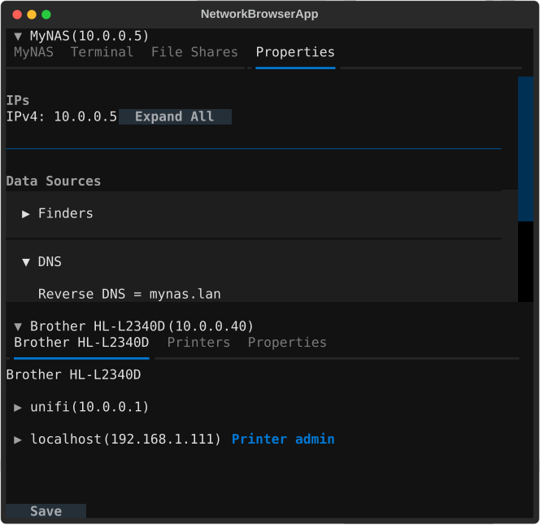

# Netlook

A network browser



Proof of concept (ai-slop-coded) network browser.

Simple network browser via:

- mDNS
- `/etc/hosts`
- `~/.ssh/known_hosts`
- ARP Cache

This is built for my own use, I couldn't remember the IPs for everything on my network, this can
pull some basic information back on things like:

- **File shares:** SMB (via WSDD and MDNS), SFTP
- **Printers:** CUPS, IPP
- **Admin pages:** Discovered via MDNS

Expanding a device row shows a tab per thing it can do, in this order:

## Names Tab

Identity: icon, hostname and any known aliases, each tagged with the discovery source
(mDNS, `/etc/hosts`, `known_hosts`, ARP) that reported it.

## Printers Tab

Links to the printer admin if available (CUPS, IPP).


## Screen Share Tab

Launch links for remote desktop protocols: RDP, VNC, Moonlight.


## Terminal Tab

Launch an SSH session.


## File Shares Tab

View and browse to smb (Windows) file shares and sftp (on ports 22 and 2222).

File shares will open in the users default file browser.


## Virtual Machines Tab

Incus web admin and ssh via Remina.


## System Tab

Web admin link for Home Assistant, when discovered.


## Properties Tab

View information published on the network:

- IPv4, IPv6
- DNS names
- mDNS (apple Bonjour)
- WSD (Windows Discovery used by smb/Windows file shares)

Sources: See which services published the server info (e.g. mDNS etc).


## Run

```sh
$ uv run netlook
```


## Test

```sh
$ uv run pytest
```


## TUI (Text User Interface)

There is a TUI implemented with Textual

```sh
$ uv run netlooktui
```



